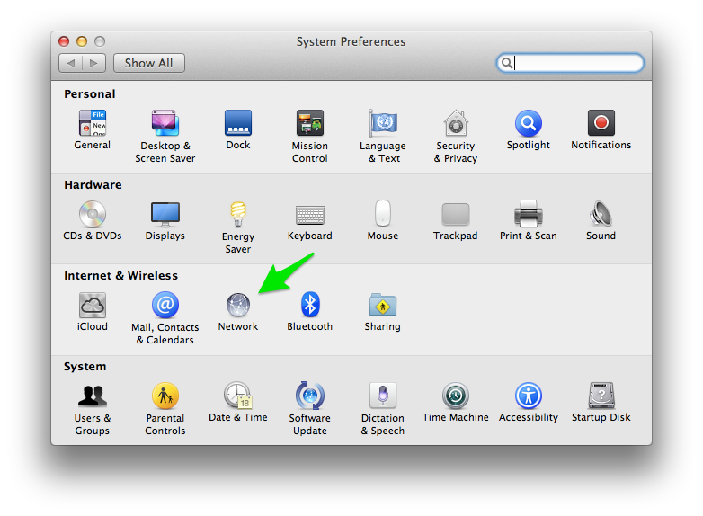
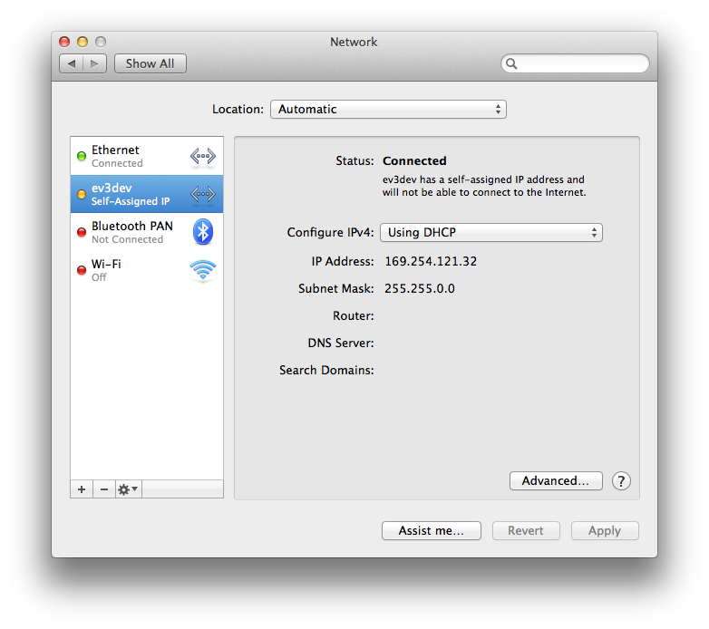

If you have not already, make sure you have followed the instructions in [Getting Started Step 4](Getting-started-v2#step-4-enable-usb-networking).

1. On your Mac, open up *System Preferences* and select *Network*.

    

2. Once you get the *Network* dialog, click on the `+` icon in the lower left area to add a new network device. You'll need to select the CDC Composite Gadget in the drop down box. The name will be similar to what is shown below. I have renamed the service "ev3dev" so it's easier to keep track of later. Click *Create* when you are done.

    

3. Click *Apply* to save your changes. The ev3dev entry (or whatever you named it) should show connected after a second. The *Router* address is the address of the EV3. We will be using this momentarily.

    

4. For `ssh` access to the EV3 under OS X, you can use the good old `ssh` program from the terminal window. I'm sure there are other solutions, and if you send me your suggestions I'll add them to a list.

        host:~ user$ ssh root@192.168.3.1

   If you have never connected before, you will prompted to confirm the authenticity of the host, so type `yes` when prompted.

        The authenticity of host '192.168.3.1 (192.168.3.1)' can't be established.
        RSA key fingerprint is xx:xx:xx:xx:xx:xx:xx:xx:xx:xx:xx:xx:xx:xx:xx:xx.
        Are you sure you want to continue connecting (yes/no)? yes
        Warning: Permanently added '192.168.3.1' (RSA) to the list of known hosts.

    The default root password is `r00tme`.

        root@192.168.3.1's password: 
        Linux ev3dev 3.3.0-0-ev3dev #2 PREEMPT Wed Mar 19 20:10:05 CDT 2014 armv5tejl
                     _____     _
           _____   _|___ /  __| | _____   __
          / _ \ \ / / |_ \ / _` |/ _ \ \ / /
         |  __/\ V / ___) | (_| |  __/\ V /
          \___| \_/ |____/ \__,_|\___| \_/
        
        Debian GNU/Linux 7 on LEGO MINDSTORMS EV3!
        
        The programs included with the Debian GNU/Linux system are free software;
        the exact distribution terms for each program are described in the
        individual files in /usr/share/doc/*/copyright.
        
        Debian GNU/Linux comes with ABSOLUTELY NO WARRANTY, to the extent
        permitted by applicable law.
        root@ev3dev:~# 

5. Now check out the list of "first things" you should do with ev3dev.