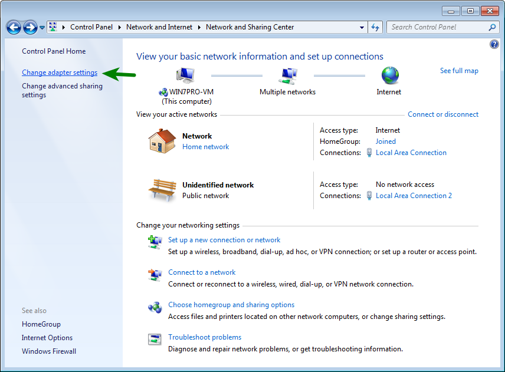
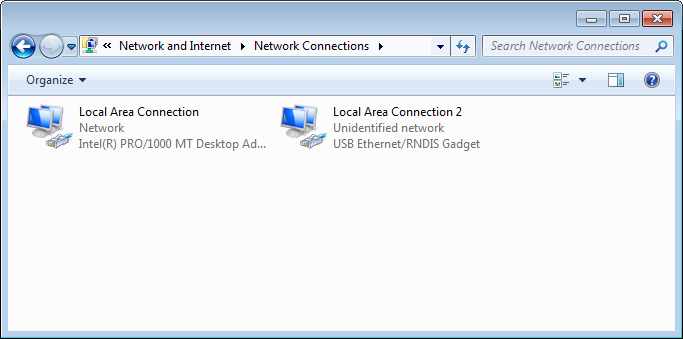
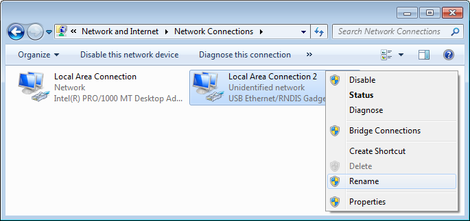
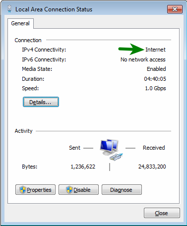
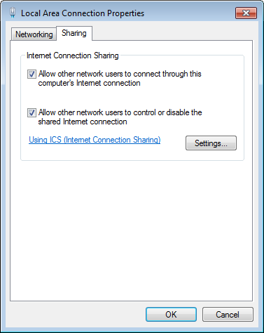
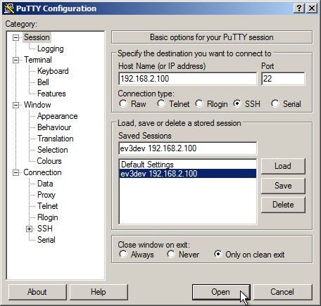
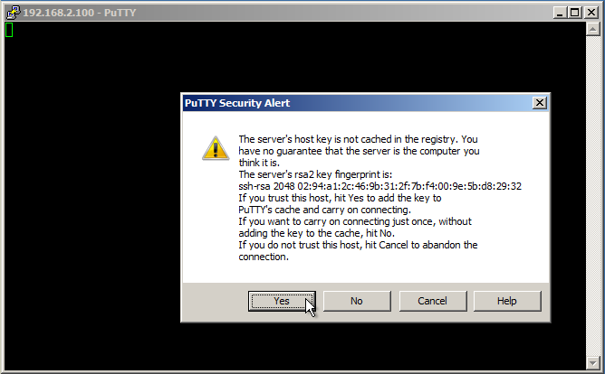
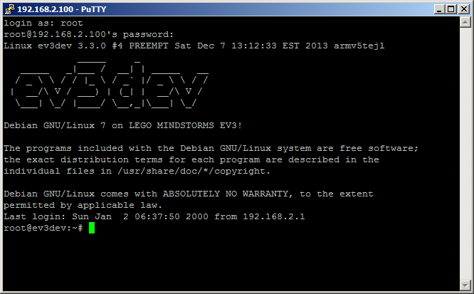

If you have not already, make sure you have followed the instructions in [Getting Started Step 4](Getting-started-v2#step-4-enable-usb-networking).

**IMPORTANT: There seem to be issues with Internet Connection Sharing and Windows 8: See issue #48 before wasting your time.**

1. On your host computer, open up the *Network and Sharing Center* either using the notification tray icon or using *Control Panel > Network and Internet > Network and Sharing Center*. Click on *Change adapter settings*.

    

2. You should see a connection that says *USB Ethernet/RNDIS Connection*. If you don't see it... TODO: Add link to troubleshooting tips from exiting wiki page.

    

3. This is the EV3. Let's rename it so it is easy to identify. Right-click the *USB Ethernet/RNDIS* adapter and select *Rename*. Call it EV3 or whatever you like.

    

4. Now, we need to share our Internet connection with the EV3. Double-click the other network connection. This will show the connection status. If you have more than one other connection, you will want to verify that this connection is indeed the Internet connection.

    

5. Click on the *Properties* button. In the window that opens, select the *Sharing* tab and check the box that says *Allow other network users to connect through this computer's Internet connection*.

    
    
    Click *OK* when you are done and close the status window as well. Windows will automatically reconfigure your other network connections.

4. Now, we need to find out what IP address our EV3 has. Windows is not very nice and will not tell us what it is. So, you have can do one of these two options.

    * You can plug a USB keyboard into the EV3 and log in. Run ifconfig to show the network status. Use Shift+PgUp if you need to scroll. Look for usb0. It should have an address assigned of 192.168.137.?.

    * We know the address starts will 192.168.137., so we can just try pinging all 253 possible addresses. On a command prompt in Windows, run:

            C:\>for /l %x in (2,1,254) do ping -n 1 -w 10 192.168.137.%x | find "Reply"

        Watch for the line that has a reply and that is the address of your EV3.

6. Now we are going to connect to the EV3 using ssh. To do this, you need a program call [PuTTY](http://www.chiark.greenend.org.uk/%7Esgtatham/putty/).

    Start PuTTY. In the *PuTTY Configuration* window, type the IP address that you found in the box that says *Host Name (or IP Address)*. It will be different from the one in the screenshot. Then click the *Open* button to connect.

    

    The first time you connect, you'll get a warning about the new RSA fingerprint.

    

    Once you're connected, type in the userid as `root` and the password as `r00tme` and you should be connected.

    

7. Now check out the list of [first things](Getting-started-v2#step-7-first-things-to-do-with-ev3dev) you should do with ev3dev.