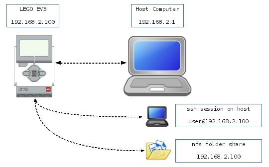

Watch this space for more detailed instructions than those in the individual README.md files in the repository.

[Getting Started](#GettingStarted) - Do this stuff first to establish a known-good platform
[Next Steps](#NextSteps)

### <a name="GettingStarted"/> Getting Started

- [Writing A microSD Card](https://github.com/mindboards/ev3dev/wiki/Writing-A-microSD-Card)

The easiest way to get started with `ev3dev` hacking is to use USB/Ethernet networking so that you can `ssh` directly to the brick without the need for a wifi conenction.

We're assuming that you've got:

1. A [microSD card with the `ev3dev` image](https://github.com/mindboards/ev3dev/wiki/Writing-A-microSD-Card) loaded
2. The USB cable that comes with the EV3
3. A Linux/OSX/Windows host computer/tablet with a free host USB port
4. The `ev3dev.rc.local` file on the FAT32 partition of the microSD card configured for your host machine.

Connect the USB-mini end of the cable to the EV3, and leave the host end disconnected from your computer for now. Then boot the EV3. When you see the `ev3dev` signon logo on the LCD, you know that the EV3 is ready to communicate with your host machine.

- [Setting Up Linux USB Ethernet Networking](https://github.com/mindboards/ev3dev/wiki/Setting-Up-Linux-USB-Ethernet-Networking)
- [Setting Up Windows Ethernet Networking](https://github.com/mindboards/ev3dev/wiki/Setting-Up-Windows-USB-Ethernet-Networking)
- [Setting Up OSX Ethernet Networking](https://github.com/mindboards/ev3dev/wiki/Setting-Up-OSX-USB-Ethernet-Networking)

Once you have basic networking running between the EV3 running `ev3dev` and your host computer, then set up an NFS file share between them. This allows files on your host computer to be visible on the EV3. It makes updates, programming, debugging, etc a LOT easier becuase you don't have to shuffle the microSD card between the EV3 and your computer, and wait for the boot cycle to complete.

Just copy the files from your shared directory on the host to the EV3!

- [Set Up An nfs FileShare](https://github.com/mindboards/ev3dev/wiki/Set-Up-An-nfs-FileShare)

After completing these steps, you'll be ready to move on - here's what you've got working so far!

### <a name="NextSteps"/> Next Steps

From this point forward, there are very few host-specific steps. The purpose of the [Getting Started](#GettingStarted) section is to have everyone get on the same page with USB/Ethernet, NFS file sharing, and logging in to their `ev3dev` enabled brick via `ssh`. It does not matter if you have a Linux host, a Windows machine, or a Mac - they are just a portal into the EV3.

Now we're going to do some other basic things, like updating the kernel, loading a new driver, and adding code to startup scripts.

Wherever possible, we'll provide links to other tutorials on the net for details. We simply don't have the time or resources to teach you how to run a text editor, or drive PuTTY on your Windows host. While [Google][Google] is  a fantastic resources, for programming questions, I find [StackOverflow][StackOverflow] much better for answering many general Linux and networking issues. The [DebianWiki][DebianWiki], while not the prettiest website is full of good information too.

- [Updating the Kernel](https://github.com/mindboards/ev3dev/wiki/Updating-The-Kernel)

### Below this point is still under development

- [Setting Up wifi Networking](https://github.com/mindboards/ev3dev/wiki/Setting-Up-wifi-Networking)

- [Add An Unsupported wifi Dongle](https://github.com/mindboards/ev3dev/wiki/Add-An-Unsupported-wifi-Dongle)
- [Loading A Driver Module](https://github.com/mindboards/ev3dev/wiki/Loading-A-Driver-Module)

### Documentation on Individual Loadable EV3 Drivers

- [Using the ev3dev_ui.ko Module](https://github.com/mindboards/ev3dev/wiki/Using-the-ev3dev_ui.ko-module)

### AM1808 Reference Docs

- [AM1808 ARM® Microprocessor](http://www.ti.com/lit/ds/sprs653d/sprs653d.pdf)
- [AM1808 Technical Reference Manual](http://www.ti.com/lit/ug/spruh82a/spruh82a.pdf)
- [AM1808 Pinmux Utility (Windows only)](http://www.ti.com/lit/an/spraba2a/spraba2a.pdf)

### LCD Module Reference Docs

The datasheet:

- [ST7586S Datasheet](http://pdf1.alldatasheet.com/datasheet-pdf/view/326182/SITRONIX/ST7586S.html)

And some interesting supplementary reading:

- [Passing Time with the SPI Framebuffer Driver](http://elinux.org/images/1/19/Passing_Time_With_SPI_Framebuffer_Driver.pdf)
- [Matt Porter's ST7586S Board Support Changes](https://github.com/ohporter/linux/commits/st7586fb)
- [Matt Porter's comments on the ST7586S Controller](https://plus.google.com/+JamesKasper/posts/EtTj24hBao3)
- [Matt Porter's Google+ Circle](https://plus.google.com/108244279740379322507/posts/KfWiuzGRRKx)

[Google]: http://www.google.com
[StackOverflow]: http://www.stackoverflow.com
[DebianWiki]: http://wiki.debian.org

