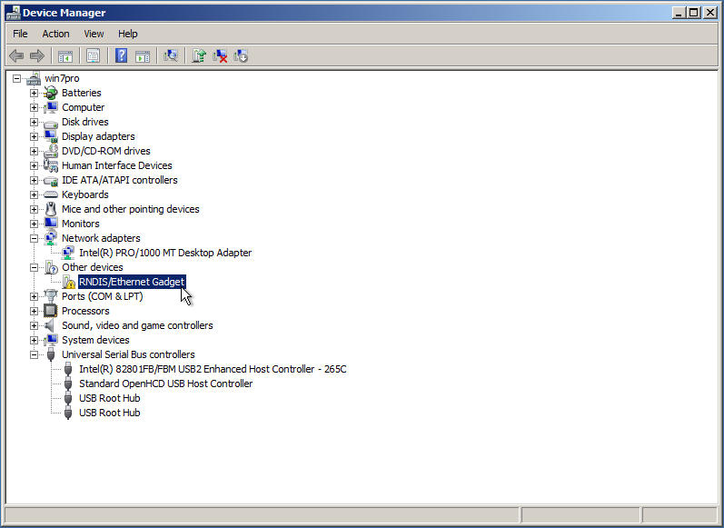
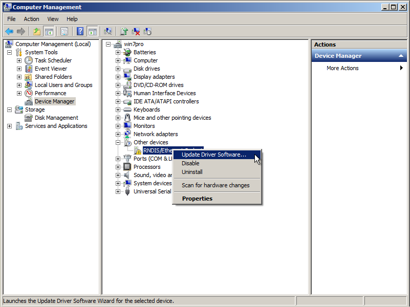
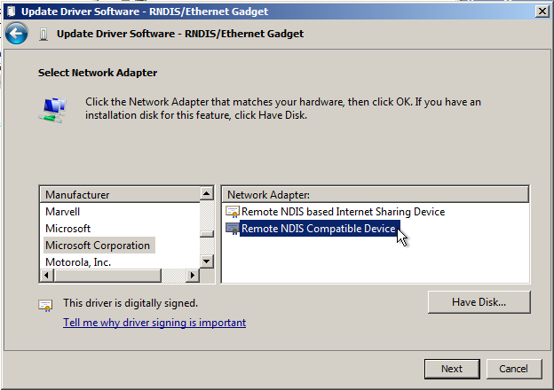
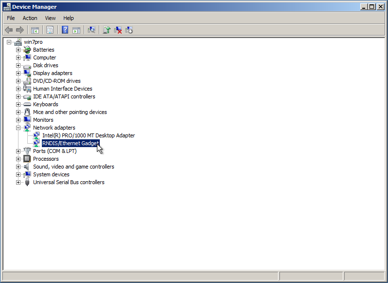
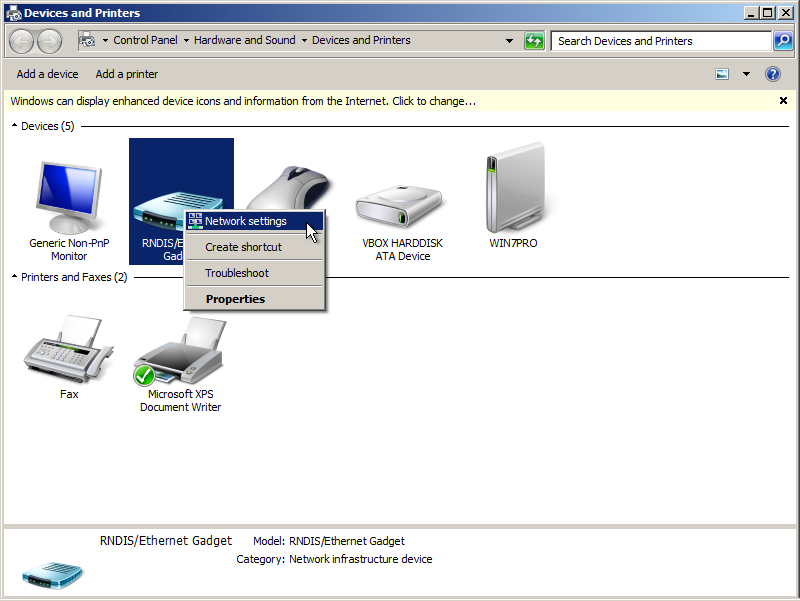
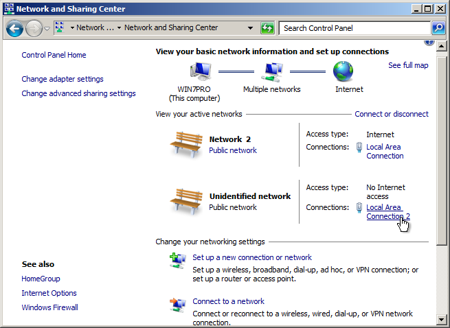
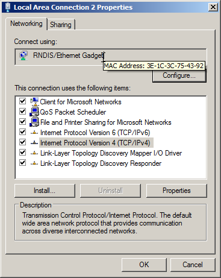
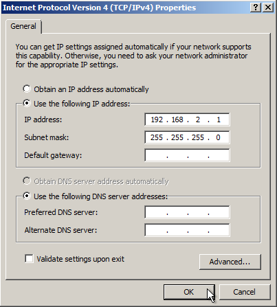
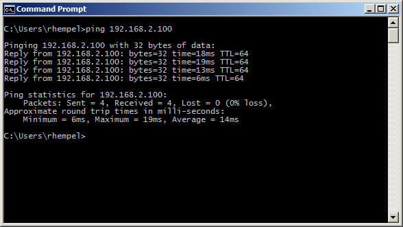
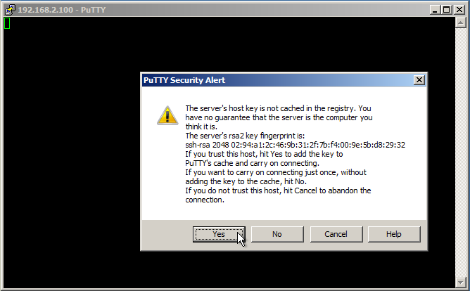

## <a name="ConnectingToWindowsHost"/> Connecting to a Windows Host

This set of instructions is a bit heavy on screenshots, and it's designed for Windows 7 - I have no idea if it will work on Windows 8. The first person to confirm it works on Windows 8 gets a nice thank-you in this wiki!

Please note that these instructions assume a certain familiarity with basic Windows device management. You may need to contact a friend to help with the first time setup, but after that it's straight to the `ssh` session for hacking on `ev3dev`

The first time you plug the EV3 running `ev3dev` into your Windows machine, one of two things will happen. You'll either see a new RNDIS network device, or you won't. Let's deal with the non-functional cases first.

Open up the Device Manager and locate the RNDIS network device - if it's not working it will look like this. If the RNDIS device shows up in the "Network Adapters" section, then skip ahead to [Setting the IP Address](#SettingIPAddress)

Here we go! Right click on the "RNDIS/Ethernet Gadget" and choose "Update Driver Software..."

Choose "Browse my computer for driver software" and then "Let me pick from a list of device drivers on my computer". Then choose "Network adapters" as the device type and click "Next".

After a few moments, a drop down list of manufacturers and network adapters will appear, and you want to select "Microsoft Corporation" and "Remote NDIS Compatible Device" as shown here:

Click "Next" and then click through the "Update Driver Warning Dialog". Now the device should be showing in the "Network adapters" list, like this:  

## <a name="SettingIPAddress"/> Set the IP Address

Open the "Devices and Printers" application from the "Start" menu, and right click on the new "Remote RNDIS Compatible Device", then choose the "Network Settings" selection.

Choose one of the Active Networks in the "Network and Sharing Center" dialog. I can't tell you which one, because there's probably one for your WiFi, one for a hardwired Ethernet and so on. But it's probably the last one on the list.

On my machine, it's "Local Area Connection 2". Click on that connection, then click on "Properties", and you should see a dialog something like this:

Double click the "Internet Protocol Version 4" setting line, and set the host address of the connection. In this example, I'm using `192.168.2.1` which is my host address, NOT the target address of the EV3 running `ev3dev`.

After seting the address and mask, click "OK" and back out of the dialogs. You have now set up the RNDIS network adapter!

## <a name="TestAndConnect"/> Test And Connect To the EV3

Now it's time to test things - a simple ping of the target address (I'm assuming the default) should look like this:

For `ssh` access to the EV3, I strongly suggest getting [PuTTY](http://www.chiark.greenend.org.uk/~sgtatham/putty/), which is also available as part of the [PortableApps](http://portableapps.com/) suite of tools. 

The basic config for the EV3 at `192.168.2.100` looks like:

The first time you connect, you'll get a warning about the new RSA fingerprint:

Once you're connected, type in the userid as `root` and the default password as `r00tme` and you should be connected:

Wow - that's a lot of steps - but now you can conenct directly to the EV3 over a USB cable!